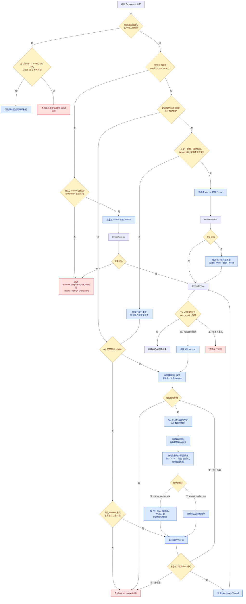

# 网关会话路由逻辑

当前路由分成两层：先判断能否继续原会话，再决定由哪个 Worker 执行。核心代码位于 [main.py](../src/codex_gateway/main.py)、[execution.py](../src/codex_gateway/execution.py)、[app_server.py](../src/codex_gateway/app_server.py) 和 [backend.py](../src/codex_gateway/backend.py)。

## 总体流程图



图中“周加权剩余额度”的计算公式为：

```text
(100 - 周已用百分比) × 套餐权重
```

例如，已用 2%、权重 1 的 Worker 得分为 98；已用 15%、权重 10 的 Worker 得分为 850。在活跃连接数相同时，后者优先。

## 1. 全新对话

### 固定 Worker 的 Key

如果 Key 配置为 `pinned`，请求只会路由到该 Key 指定的 Worker。

该 Worker 必须同时满足：

- `enabled = true`
- 状态为 `ready` 或 `busy`
- 没有被删除

如果不满足，直接返回 `worker_unavailable`，不会自动换到池内其他 Worker。

### 自动池化的 Key

系统从所有满足以下条件的 Worker 中选择：

- 已启用
- 状态为 `ready` 或 `busy`
- 不在本次排除列表内

具体选择方式：

| 请求情况 | Worker 选择方式 |
|---|---|
| 所有池化请求 | 优先选择正在占用的 WS 数最少的 Worker |
| 活跃连接数相同 | 优先选择周加权剩余额度 `(100 − 周已用百分比) × 套餐权重` 最大的 Worker |
| 连接数和额度分数都相同，且有 `prompt_cache_key` | 按 `API Key + prompt_cache_key + Worker ID` 的稳定哈希顺序选择 |
| 连接数和额度分数都相同，且没有 `prompt_cache_key` | 保留数据库随机顺序 |
| 最近两小时没有有效周额度数据 | 在同连接数下排在有有效额度数据的 Worker 后，再按缓存亲和或随机顺序选择 |
| 首选 Worker 工作区准备失败 | 隔离该 Worker，继续尝试下一个候选 |
| 所有候选均失败 | 返回 `worker_unavailable` |

“活跃连接”指连接池中正在租用或建立中的 WS，空闲等待复用的持久 WS 不计为当前负载。例如两个 Worker 活跃连接数相同时，周已用 2%、权重 1 的分数为 98；周已用 15%、权重 10 的分数为 850，因此后者优先。`busy` 状态仍属于候选状态，真正的并发上限继续由 WS 连接池控制。

周用量和权重来自最近一次 v3 `subscription_usage` 快照。快照每小时采集一次，只有采集时间距当前不超过两小时才参与路由。某个 Worker 的额度读取失败时，其分数保持未知；在活跃连接数相同的候选中，有有效额度数据的 Worker 优先于未知数据的 Worker。

`prompt_cache_key` 只帮助相同前缀优先落到相同 Worker，提高缓存复用机会，不创建会话，也不会覆盖已有会话绑定。

Worker 选定以后，系统才在这个 Worker 内：

1. 优先复用该 Key 的空闲 WS；
2. 没有空闲 WS 时按上限创建新连接；
3. 为本次 WS 使用独立工作目录；
4. 创建新的 app-server Thread。

## 2. 已有且有效的自动会话绑定

客户端携带稳定会话标识和完整历史时，系统会查询 `ExecutionSession` 和 `ResponseBinding`。

只有以下条件全部满足才恢复原 Worker 和 Thread：

- 历史是已保存历史的追加；
- 模型、instructions、工具和输出配置一致；
- ResponseBinding 仍为 `active`；
- Worker generation 没有改变；
- Worker 已启用且状态为 `ready` 或 `busy`；
- 固定 Worker 策略没有改变；
- 当前没有另一个请求持有该会话执行锁。

验证成功后：

```text
逻辑会话
  → 原 ResponseBinding
  → 原 Worker
  → 该 Worker 上任意可用 WS
  → thread/resume 原 Thread
```

这里固定的是 Worker 和 Thread，不固定原来的 WS。

## 3. 原绑定 Worker 已失效

对于通过客户端会话标识自动找到的绑定，系统允许安全重建。

以下情况会放弃原绑定：

- Worker 被停用、删除或进入异常状态；
- Worker 更换了登录账号，generation 变化；
- Key 后来改成固定到另一个 Worker；
- ResponseBinding 被管理员释放；
- 原 Worker 在实际调度前变得不可用。

处理过程是：

```text
原绑定无法使用
  → 清除自动恢复参数
  → 恢复客户端提交的完整历史
  → 按当前 Key 策略重新选择 Worker
  → 在新 Worker 上创建新 Thread
  → 发送本轮请求
```

如果 Key 是池化模式，就重新进入“活跃连接数 → 周加权剩余额度 → 缓存亲和/随机”的优选调度；如果 Key 是固定模式，就路由到当前指定的 Worker。

因此，自动关联的会话在原 Worker 失效时，可以转移到另一个 Worker，但会创建新的后端 Thread。上下文来自客户端提交的完整历史，而不是把原 Thread 跨账号迁移。

## 4. Worker 有效，但原 Thread 不存在

系统会先在原 Worker 上执行 `thread/resume`。

如果 app-server 返回 Thread 不存在，并且这次恢复属于网关自动识别的会话：

- 将旧绑定标记为不可恢复；
- 清除增量输入；
- 恢复客户端的完整历史；
- 仍在当前已选 Worker 上执行 `thread/start`；
- 创建新 Thread 后发送本轮请求。

这个场景通常不会重新选择 Worker，因为 Worker 本身仍然正常，只是 Thread 丢失。

## 5. 显式 `previous_response_id`

显式 `previous_response_id` 比自动会话关联更严格。

如果它指向的绑定：

- 已被释放；
- Worker 已删除；
- Worker 换过账号；
- generation 不一致；

系统返回 `previous_response_not_found`，不会静默换 Worker。

如果绑定仍有效，但 Worker 当前不是 `ready/busy`，返回 `session_worker_unavailable`。

如果 Worker 正常但 `thread/resume` 失败，也返回 `previous_response_not_found`，不会用完整历史自动重建。原因是显式请求有可能只携带本轮增量，网关无法证明自己拥有完整上下文。

## 6. 等待客户端工具结果的会话

工具调用必须回到原来的：

- Worker
- Thread
- WS 中挂起的 app-server RPC
- `call_id`

这类请求不能切换 Worker。Worker 被删除、换账号或挂起调用丢失时，会返回 `tool_worker_invalidated`、`tool_binding_invalidated` 或 `client_tool_call_unavailable` 等错误。

客户端只能发起一个携带完整历史的新用户轮次，让系统放弃旧工具调用并新建 Thread。

## 7. 执行前 Worker 突然失败

对于全新会话或自动恢复会话，如果满足以下条件：

- Key 是池化模式；
- 不是工具结果续接；
- Turn 尚未开始；
- 错误被标记为 `safe_to_retry`；

系统会排除刚刚失败的 Worker，再从池中选择另一个 Worker 重试一次。

第二次选择排除刚刚失败的 Worker，继续按照“活跃连接数 → 周加权剩余额度 → 随机顺序”选择，只重试一次。安全重试不会继续携带首次请求的 `prompt_cache_key` 亲和条件。

一旦 `turn/start` 可能已经执行，系统不再换 Worker，避免重复执行。

## 8. 路由优先级

整体优先级可以概括为：

```text
挂起工具调用的原 Worker
        ↓
显式 previous_response_id 的原 Worker
        ↓
历史和配置验证通过的自动绑定 Worker
        ↓
Key 当前固定的 Worker
        ↓
活跃连接数最少的 Worker
        ↓
周加权剩余额度最大的 Worker
        ↓
prompt_cache_key 亲和或随机兜底
```

其中前三项属于强绑定，后面三项属于新 Thread 的调度。最重要的区别是：**自动关联会话可以在原 Worker 失效后，用完整历史迁移到新 Worker；显式 `previous_response_id` 和挂起工具调用不会静默迁移。**
